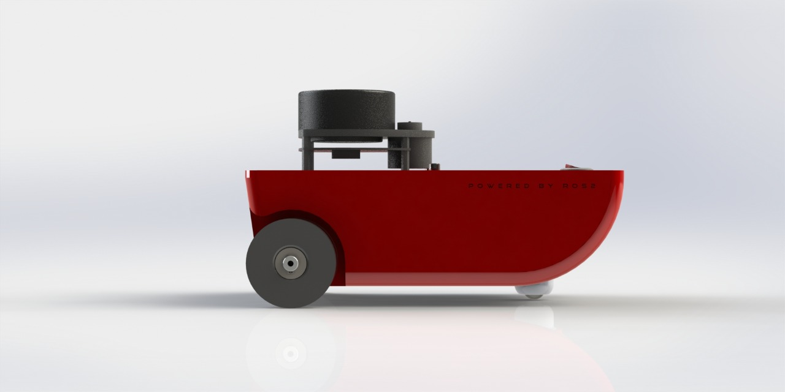
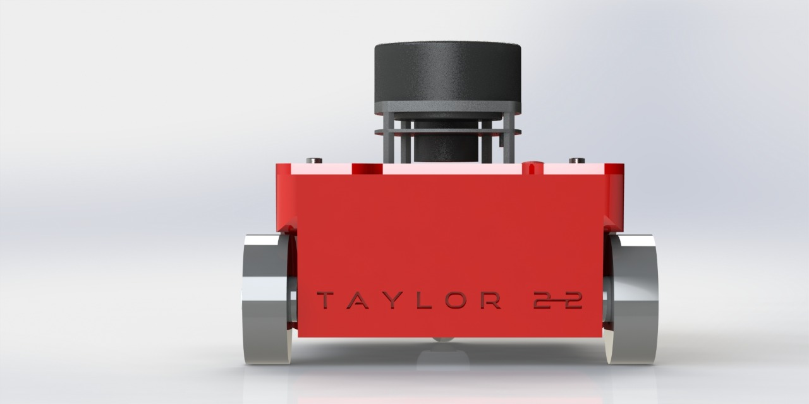
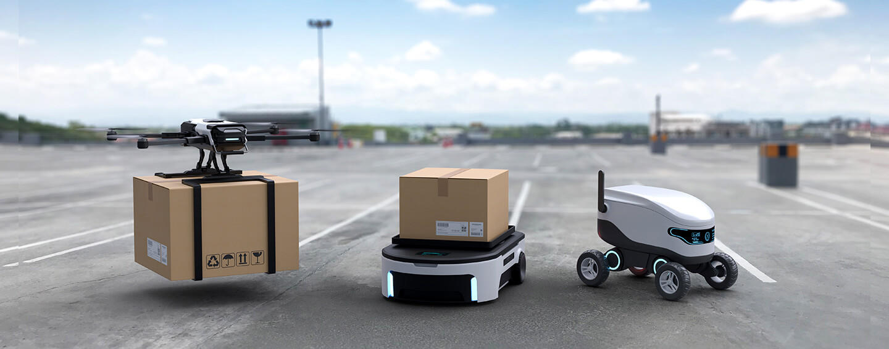

# Taylor-Robot

**Taylor** is a differential robot built using **ROS2**.

   
   
   
   

# ros2_control  

[ros2_control](https://control.ros.org/master/index.html) package is used to control the two wheels. The **Arduino Nano** is used as a hardware component that receives a command from controllers and converts it to a PWM signal for the H bridge, through the Arduino Nano the controllers can read/write to these interfaces.

It is the **Raspberry Pi B+** that runs the controllers, which compares the reference value with the measurement output from the encoders and calculates the system's input based on this error (for more details, visit [Control Theory](https://en.wikipedia.org/wiki/Control_theory)).

# Nav2 

The [Nav2](https://navigation.ros.org/) package allows mobile robots to move safely from one location to another. Using sensors, this package performs mapping, localization, and perception functions. In addition to collecting information about the environment, these sensors can be used to build and maintain a map of the environment, to pinpoint the robot on the map, and to avoid obstacles that may be encountered in that environment.

**LIDAR** (RPLIDAR A1) and **encoders** from the wheels are used as sensors for this project, so Taylor can navigate on his own in a mapped world using Nav2.

  
  

Nav2 simulation using Gazebo and Rviz

# Our Future 🚀

This project seeks to provide the groundwork for a more enthusiastic robot—an autonomous mobile robot (AMR)—and to develop a functioning prototype of it. Even though Taylor is already an AMR, we still want more! In future Taylor versions, we'll construct an AMR that can be utilized in a manufacturing environment.

AMRs pick, transport, and sort things without human interaction in production and distribution operations. They are highly desired because of their numerous benefits, which include preventing product damage, lowering labor expenses, increasing productivity, and automating procedures. AMRs are already benefiting several industries, including transportation, logistics, automotive, and food.

